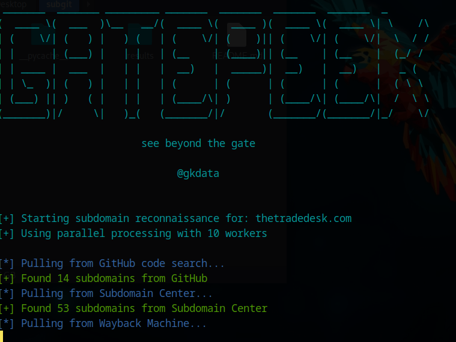

# Gatepeek - Subdomain Reconnaissance Tool

A comprehensive Python tool for subdomain enumeration and reconnaissance with advanced HTTP testing capabilities.



## Installation

### Prerequisites
- Python 3.7 or higher
- pip (Python package installer)

### Quick Install
```bash
# Clone or download the repository
git clone <repository-url>
cd gatekeep

# Install dependencies
pip install -r requirements.txt
```

### Manual Installation
If you prefer to install dependencies manually:
```bash
pip install requests>=2.31.0 colorama>=0.4.6 pyOpenSSL>=23.3.0 urllib3>=2.0.0
```

### GitHub Token Setup (Optional but Recommended)
For GitHub code search functionality, you'll need a GitHub Personal Access Token:

1. Go to GitHub Settings → Developer settings → Personal access tokens
2. Generate a new token with `repo` and `read:packages` scopes
3. Add your token to `modules/arrays/api_config.py`:
   ```python
   GITHUB_TOKEN = "your_github_token_here"
   ```

**Note**: Without a GitHub token, the tool will still work but GitHub code search will be limited.

## Features

- **Multiple Data Sources**: Wayback Machine, Subdomain Center, and GitHub code search
- **Concurrent Processing**: Parallel DNS resolution, HTTP probing, and GitHub fetching for faster scans
- **GitHub Context Tracking**: Line-level context with repository and file references for each subdomain
- **HTTP Testing**: Comprehensive HTTP method testing (OPTIONS, TRACE, PUT, POST)
- **Enhanced 403 Bypass**: Multi-layered bypass using headers, paths, and combinations
- **SSL Certificate Analysis**: Detailed SSL certificate information extraction
- **Response Classification**: Intelligent classification of responses (live, false positive, ambiguous)
- **Multiple Output Formats**: JSON summary, HTML reports, and console output
- **Configurable Arrays**: All arrays and data structures are externalized for easy customization
- **Connection Pooling**: Optimized HTTP sessions with connection reuse for better performance

## Files Structure

```
subgit/
├── gatepeek.py               # Main reconnaissance script
├── requirements.txt          # Python dependencies
├── modules/                  # Modular components
│   ├── arrays/              # Organized array configurations
│   │   ├── __init__.py      # Arrays package initialization
│   │   ├── api_config.py    # API endpoints and settings
│   │   ├── http_config.py   # HTTP testing configurations
│   │   ├── display_config.py # Display and UI settings
│   │   ├── output_config.py # Output and file settings
│   │   └── data_structures.py # Data structure templates
│   └── html_generator.py    # HTML report generation module
├── README.md                # This documentation
└── results/                 # Output directory for reports
```

## Configuration

All configuration arrays and data structures are now organized in the `modules/arrays/` directory for easy customization:

### API Configuration
- `WAYBACK_API`: Wayback Machine API endpoint
- `SUBDOMAIN_CENTER_API`: Subdomain Center API endpoint
- `TIMEOUT`: Request timeout in seconds
- `GITHUB_TOKEN`: GitHub Personal Access Token

### Concurrency Settings
- `MAX_WORKERS`: General maximum worker threads
- `DNS_WORKERS`: Number of threads for DNS resolution
- `HTTP_WORKERS`: Number of threads for HTTP checking
- `GITHUB_WORKERS`: Number of threads for GitHub processing

### HTTP Testing
- `HTTP_PROTOCOLS`: Protocols to test (http://, https://)
- `HTTP_METHODS`: HTTP methods to test (OPTIONS, TRACE, PUT, POST)
- `BYPASS_STATUS_CODES`: Status codes that trigger bypass attempts
- `BYPASS_PAYLOADS`: Headers to try for 403 bypass

### Response Classification
- `FALSE_POSITIVE_INDICATORS`: Keywords indicating false positives
- `LIVE_INDICATORS`: Keywords indicating live responses

### Display Settings
- `IMPORTANT_HEADERS`: Headers to capture in HTTP method testing
- `DISPLAY_HEADERS`: Headers to display in results
- `RESPONSE_PREVIEW_LENGTH`: Length of response previews
- `HTML_PREVIEW_LINES`: Number of HTML lines to preview

### Output Settings
- `RESULTS_DIR`: Directory for output files
- `JSON_INDENT`: JSON indentation level
- `MIN_BOX_WIDTH`: Minimum width for console output boxes

## Usage

### Basic Usage
```bash
python gatepeek.py
```


### Customizing Arrays
Edit the appropriate file in `modules/arrays/` to modify configuration:

```python
# Example: Add new bypass payload (in modules/arrays/http_config.py)
BYPASS_PAYLOADS.append({"X-Custom-Header": "custom-value"})

# Example: Add new false positive indicator (in modules/arrays/display_config.py)
FALSE_POSITIVE_INDICATORS.append("new-indicator")

# Example: Change timeout (in modules/arrays/api_config.py)
TIMEOUT = 15

# Example: Adjust concurrency settings (in modules/arrays/api_config.py)
DNS_WORKERS = 20  # More DNS workers for faster resolution
HTTP_WORKERS = 30  # More HTTP workers for faster checking
```

## Output Files

The tool generates several output files in the `results/` directory:

1. **Initial Subdomains** (`{domain}_{timestamp}_subdomains.json`): Raw list of discovered subdomains
2. **Detailed Summary** (`{domain}_{timestamp}_summary.json`): Complete scan results with classification
3. **HTML Report** (`{domain}_{timestamp}_report.html`): Visual HTML report with all findings

## Key Improvements

### Modular Architecture
- **Organized Arrays**: Arrays split into logical categories in `modules/arrays/`
- **HTML Generator Module**: Separate module for HTML report generation
- **Clean Separation**: Clear separation between configuration, logic, and output
- **Easy Maintenance**: Each component can be modified independently

### Array Organization
- **API Configuration** (`api_config.py`): Endpoints, timeouts, tokens
- **HTTP Configuration** (`http_config.py`): Protocols, methods, bypass payloads
- **Display Configuration** (`display_config.py`): UI settings, indicators
- **Output Configuration** (`output_config.py`): File settings, status mappings
- **Data Structures** (`data_structures.py`): Templates and schemas

### HTML Generator Module
- **Object-Oriented Design**: Clean class-based structure
- **Modular Methods**: Each HTML section generated by separate methods
- **Easy Customization**: CSS styles and HTML structure easily modifiable
- **Reusable**: Can be used by other scripts

### Session Manager Module
- **Connection Pooling**: Reuses TCP connections for faster HTTP requests
- **Retry Logic**: Automatic retry with exponential backoff
- **Optimized Headers**: Pre-configured headers for better compatibility
- **Resource Management**: Proper cleanup of connections

### GitHub Context Module
- **Line-Level Tracking**: Tracks exact line numbers where subdomains are found
- **Repository Analysis**: Extracts repository, branch, and file information
- **URL Parsing**: Parses GitHub URLs to extract detailed context
- **Context Formatting**: Organizes context information for easy consumption

### Enhanced Bypass Module
- **Multi-Layered Approach**: Header-based, path-based, and combination bypasses
- **Comprehensive Paths**: 144+ bypass paths covering admin, API, CMS, and more
- **Path Traversal**: URL encoding and directory traversal bypasses
- **Smart Combinations**: Combines headers and paths for maximum effectiveness
- **Redundancy Check**: Validates bypass success by comparing content and status codes
- **Detailed Logging**: Tracks bypass types, methods, and success rates in HTML reports

### Benefits
- **Performance**: Parallel processing significantly speeds up large scans
- **Traceability**: Line-level GitHub context provides exact source locations
- **Maintainability**: Easy to update specific components without affecting others
- **Reusability**: Modules can be imported and used by other scripts
- **Customization**: Simple to modify behavior through organized configuration
- **Testing**: Each module can be tested independently
- **Documentation**: Clear structure makes configuration self-documenting
- **Scalability**: Easy to add new modules and features
- **Efficiency**: Connection pooling reduces overhead and improves speed

## Performance Improvements

### Concurrent Processing Benefits
- **DNS Resolution**: ~5-10x faster with parallel processing
- **HTTP Checking**: ~3-5x faster with connection pooling and parallel requests
- **GitHub Processing**: ~2-3x faster with parallel page and item processing
- **Overall Scan Time**: Significantly reduced for large subdomain lists

### Example Performance Metrics
```
Sequential Processing:
- 100 subdomains: ~30-60 seconds
- 500 subdomains: ~2-5 minutes

Concurrent Processing:
- 100 subdomains: ~5-10 seconds
- 500 subdomains: ~30-60 seconds
```

## GitHub Context Enhancement

### Line-Level Context Tracking
- **Exact Line Numbers**: Tracks the exact line where each subdomain is found
- **Repository Information**: Extracts owner, repository, branch, and file details
- **Source URLs**: Provides direct links to GitHub files with line numbers
- **Context Analysis**: Groups references by repository and file

### Context Information Provided
```
Subdomain: api.example.com
├── Total References: 15
├── Unique Repositories: 3
├── Files: 8
└── Repositories:
    ├── user/repo: 8 references
    ├── another/project: 5 references
    └── third/application: 2 references
```

### Output Integration
- **Console Display**: Shows repository and reference counts
- **JSON Reports**: Includes full GitHub context data
- **HTML Reports**: Interactive links to GitHub source files
- **Line Numbers**: Direct links to specific lines in GitHub files

## Enhanced 403 Bypass System

### Multi-Layered Bypass Approach
- **Header-Based Bypasses**: 7 different header manipulation techniques
- **Path-Based Bypasses**: 144+ paths covering various application types
- **Combination Bypasses**: Smart combinations of headers and paths
- **Progressive Testing**: Tests each layer before moving to the next

### Bypass Categories
```
Admin & CMS: /admin, /wp-admin, /administrator, /cpanel
API & Development: /api, /api/v1, /rest, /graphql, /swagger
Configuration: /.env, /.git, /config, /wp-config.php
Path Traversal: /..;/, /%2e%2e/, /..%2f, /..%c0%af
File Extensions: /.json, /.xml, /.txt, /.log, /.bak
Monitoring: /status, /health, /ping, /info, /debug
```

### Bypass Success Tracking
- **Bypass Type**: Header, path, or combination
- **Success Rate**: Tracks which bypass methods work
- **Detailed Reporting**: Shows exact bypass method used
- **HTML Integration**: Displays bypass information in reports
- **Content Validation**: Ensures bypass returns different content, not just different status
- **Statistics Dashboard**: Shows bypass success rates and type distribution
- **Redundancy Prevention**: Avoids false positives from login pages or error redirects

## Redundancy Check System

### Smart Bypass Validation
The system now validates bypass success by comparing:
- **Status Code**: Must not be 403 or 401
- **Content Difference**: Response body must be different from original
- **Status Change**: Status code must be different from original

### Validation Logic
```python
# Only consider bypass successful if:
if bcode and bcode not in [403, 401] and bcode != status and bbody != body:
    # True bypass - different content and status
    return successful_bypass
elif bcode:
    # False positive - same content or still error
    return redundant_bypass
```

### Benefits
- **Eliminates False Positives**: No more login pages or error redirects counted as bypasses
- **Accurate Success Rate**: Only counts genuine bypasses
- **Better Reporting**: Clear distinction between successful and failed bypasses
- **Improved Analysis**: More reliable bypass statistics

## Requirements

```bash
pip install requests colorama pyOpenSSL
```

## Security Note

⚠️ **Important**: The GitHub token in `modules/arrays/api_config.py` should be kept secure and not shared publicly. Consider using environment variables for sensitive tokens in production environments.

## License

This tool is for educational and authorized security testing purposes only. Always ensure you have proper authorization before scanning any domains. 